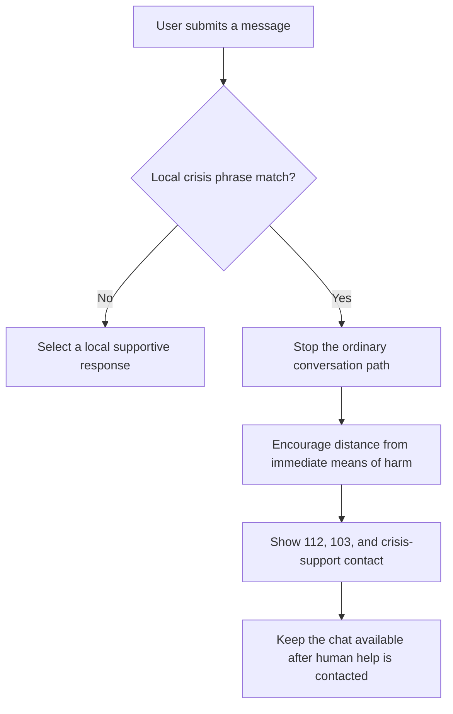

# Architecture

## Current state

The repository is a zero-backend prototype:

```text
index.html  -> page structure and support resources
styles.css  -> responsive visual system
app.js      -> navigation, local conversation rules, crisis routing
```

All conversation processing happens in the browser. Messages are held only in the current DOM and are removed when the page is closed or the user clears the conversation.

There is currently:

- no authentication;
- no database;
- no analytics;
- no remote model;
- no server-side logging;
- no clinical decision support.

## Current crisis flow



The current phrase matching is a demonstration, not a validated classifier.

## Proposed production boundaries

A production architecture should separate:

1. **Client application** — accessible conversation UI and local emergency controls.
2. **Session gateway** — short-lived anonymous sessions, rate limits, and regional configuration.
3. **Safety layer** — independent pre- and post-generation risk checks with deterministic emergency fallbacks.
4. **Conversation service** — constrained model orchestration and retrieval from reviewed content.
5. **Resource directory** — versioned, verified support contacts with expiry dates.
6. **Human handoff** — explicit consent and partner-specific escalation.
7. **Audit system** — aggregate safety events without storing raw conversations by default.

## Data minimization

The default production data flow should not require a name, military unit, phone number, precise location, or account.

Raw conversation retention should be off by default. Any optional quality-review program must use:

- explicit, revocable consent;
- automatic removal of direct identifiers;
- short retention periods;
- strict role-based access;
- a documented deletion path.

## Safety invariants

These behaviors should not depend on model availability:

- emergency contacts remain visible when the backend is unavailable;
- users can exit, clear, or call for help at any time;
- crisis routing cannot be replaced by a generated answer;
- unsupported medical requests receive a clear boundary;
- resource links include provenance and verification dates.

## Threats to account for

- prompt injection into support content;
- accidental disclosure through logs or analytics;
- abuse of the service to target a vulnerable person;
- false reassurance during an acute crisis;
- outdated or unavailable support contacts;
- adversarial attempts to suppress crisis routing;
- model output that diagnoses, shames, or coerces;
- device access by another person after a conversation.

## Testing strategy

The project should develop:

- deterministic unit tests for crisis routing;
- accessibility checks for keyboard and screen-reader use;
- multilingual behavioral test cases;
- adversarial safety evaluations;
- link and phone-number verification;
- mobile performance budgets;
- human review of high-risk conversation samples.
